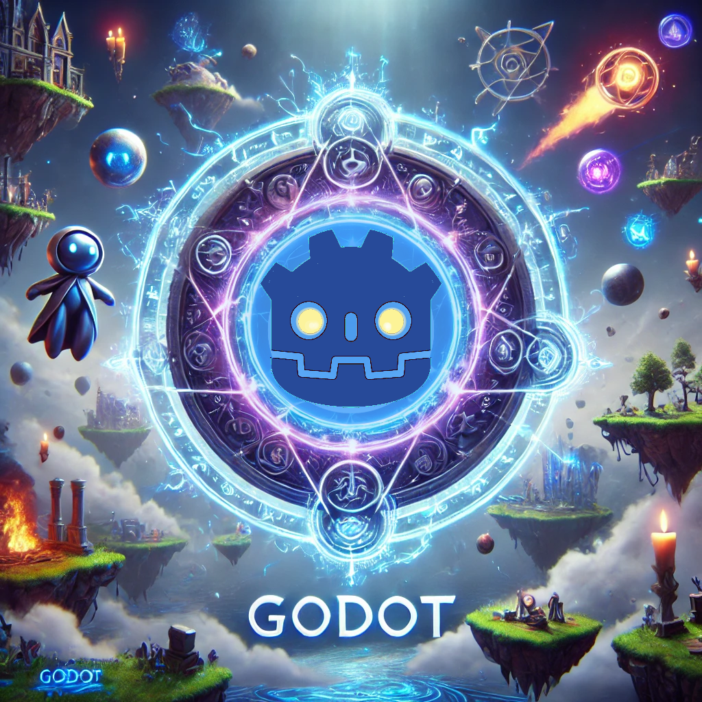

    

  
  

-------

  

[PODCAST](https://www.linkedin.com/in/andy-cusatti/)
# Projeto artigo técnico gerado por I.A.s

### Godot Engine: La Revolución del Desarrollo de Videojuegos para Desarrolladores Entusiastas

El mundo del desarrollo de videojuegos está en constante evolución, y Godot Engine se ha posicionado como una de las herramientas más poderosas y accesibles para creadores de todo tipo. Ya seas un desarrollador independiente o parte de un pequeño equipo, Godot ofrece una combinación única de flexibilidad, facilidad de uso y capacidades técnicas avanzadas que lo hacen destacar en la industria. Si eres un desarrollador entusiasta buscando una plataforma que te permita liberar tu creatividad sin comprometer la calidad, este artículo es para ti.

#### ¿Qué es Godot?

Godot es un motor de desarrollo de videojuegos de código abierto que permite a los desarrolladores crear juegos 2D y 3D con una eficiencia impresionante. Lanzado inicialmente en 2014, Godot ha ganado popularidad por ser completamente gratuito y libre de regalías, lo que significa que puedes desarrollar y vender tus juegos sin preocuparte por licencias costosas o restricciones.

#### Aspectos Destacados de Godot

**1. Versatilidad en 2D y 3D**  
Godot ofrece un entorno de desarrollo integrado que soporta tanto juegos 2D como 3D. A diferencia de otros motores, que suelen enfocarse más en una de estas áreas, Godot brinda herramientas igualmente robustas para ambos formatos. Su motor 2D está diseñado específicamente para evitar problemas comunes de otros motores 3D, como el aliasing y el rendimiento pobre en juegos bidimensionales.

**2. GDScript: El Lenguaje del Desarrollador**  
Godot cuenta con su propio lenguaje de programación, GDScript, que está diseñado para ser fácil de aprender y usar, especialmente para aquellos familiarizados con Python. GDScript es ligero, rápido y se integra perfectamente con el entorno de Godot, permitiendo una programación rápida y eficiente. Además, Godot soporta otros lenguajes como C#, VisualScript, y hasta C++ para aquellos que buscan un mayor control.

**3. Sistema de Escenas y Nodos**  
Una de las características más innovadoras de Godot es su sistema de escenas y nodos. En lugar de seguir un enfoque basado en objetos, Godot utiliza un sistema jerárquico de nodos, donde cada elemento en un juego es un nodo que se puede combinar y reutilizar en múltiples escenas. Este sistema modular simplifica el desarrollo y fomenta la reutilización de código y recursos, lo que resulta en un flujo de trabajo más limpio y organizado.

**4. Multiplataforma y Exportación Sencilla**  
Godot permite la exportación de juegos a múltiples plataformas con solo un clic. Ya sea que estés desarrollando para Windows, macOS, Linux, Android, iOS o incluso HTML5, Godot facilita el proceso de exportación, permitiéndote alcanzar una audiencia global sin complicaciones adicionales.

**5. Comunidad y Recursos Abundantes**  
Al ser un motor de código abierto, Godot cuenta con una comunidad activa y creciente que contribuye constantemente a su desarrollo. La comunidad ofrece una gran cantidad de recursos, desde tutoriales y documentación hasta foros y repositorios de código. Esto significa que nunca estarás solo en tu viaje de desarrollo; siempre habrá alguien dispuesto a ayudar o compartir su conocimiento.

#### Ejemplos de Juegos Desarrollados con Godot

**1. *Kingdoms of the Dump***  
Un RPG 2D que destaca por su rica narrativa y estilo retro, *Kingdoms of the Dump* es un excelente ejemplo de cómo Godot puede ser utilizado para crear experiencias inmersivas y visualmente atractivas en 2D. El juego, desarrollado por un equipo pequeño de entusiastas, demuestra que con Godot, es posible crear juegos que rivalizan con títulos comerciales en términos de calidad y contenido.

**2. *The Garden Path***  
Este es un juego de simulación de vida que utiliza el motor 2D de Godot para crear un mundo relajante y visualmente encantador. Con un estilo artístico único y mecánicas de juego envolventes, *The Garden Path* muestra cómo Godot puede ser utilizado para crear juegos indie que destacan tanto por su estética como por su jugabilidad.

**3. *Cruelty Squad***  
Este es un FPS surrealista y provocador que explora temas de distopía y nihilismo. A pesar de su apariencia minimalista y su enfoque experimental, *Cruelty Squad* ha ganado una base de fans leal y se ha convertido en un ejemplo de cómo Godot puede ser utilizado para crear experiencias de juego únicas y desafiantes.

#### Conclusión: Godot, Tu Compañero de Creación

Godot es más que un simple motor de videojuegos; es una plataforma que empodera a los desarrolladores para convertir sus ideas en realidad. Su versatilidad, facilidad de uso, y comunidad de apoyo lo hacen una opción ideal para cualquier desarrollador entusiasta que quiera llevar sus proyectos al siguiente nivel. Si estás listo para embarcarte en el emocionante mundo del desarrollo de videojuegos, Godot es la herramienta perfecta para ayudarte a dar vida a tus sueños.

## 💻 Tecnologias utilizadas no projeto

- [ChatGPT](https://chat.openai.com/) - para título e conteúdo
- [Lexica.art](https://lexica.art/) - para gerar imagens
- [Krita](https://krita.org/es/) - Para modificacion de imagenes

## 📄 Prompts e ferramentas

ChatGPT：

|   Ação   | prompt                                                                                                                                                                                                                                                                         |
| :------: | ------------------------------------------------------------------------------------------------------------------------------------------------------------------------------------------------------------------------------------------------------------------------------ |
|  título  | Crie 10 headlines para nomes de artigos sobre o assunto Angular - Diretivas                                                                                                                                                                                                    |
| conteúdo | Faça um texto para ebook , com foco em CSS, listando os principais seletores CSS com exemplos em código {REGRAS} Explique sempre de uma maneira simples Deixe o texto enxuto, Sempre traga exemplos de código em contextos reais , sempre deixe um título sugestivo por tópico |

Lexica.art：

- Solo para explorar algunos ejemplos de imagenes

## ✨ Features

- Conteúdo gerado via ChatGPT
- Imagens do acervo público geradas via ChatGPT

## 📚 Materiais

- prompts utilizados
- Crea un articulo llamativo sobre godot para el desarrollo de video juegos resaltando los aspectos mas importantes y dando ejemplo de juegos desarrollados en esta plataforma orientado a desarrolladores entusiastas
- Crea una imagen a partir del logo de godot 3d donde luzca poderosa, con magia, rayos y un fondo de juegos en 3d usando la imagen del logo de godot 

## 🛠️ Instruções de execução

Utilize os prompts acima nas ferramentas sugeridas para gerar o material base e utilize uma ferramenta de edição de documentos como power point, libreoffice , indesign para diagramação, o passo a passo em vídeo pode ser conferido na plataforma da [DIO](https://dio.me).

## 👨‍💻 Expert

    
    
&nbsp&nbsp&nbspCusatti Andy 
    &nbsp&nbsp&nbsp
    <a href="https://github.com/macuare">
    GitHub</a>&nbsp;|&nbsp;
    <a href="https://www.linkedin.com/in/andy-cusatti/">LinkedIn</a>
&nbsp;|&nbsp;
    <a href="https://www.instagram.com">
    Instagram</a>
&nbsp;|&nbsp;

  

---

⌨️ com 💜 por [Cusatti Andy](https://www.linkedin.com/in/andy-cusatti/)
